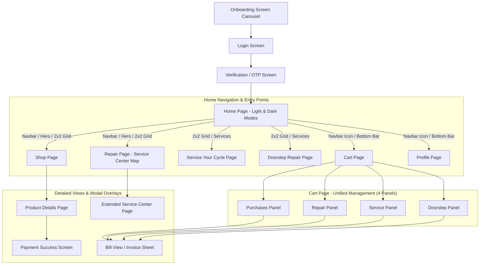
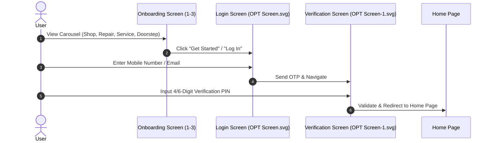
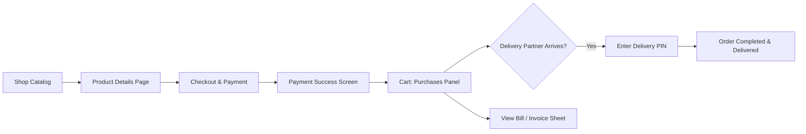
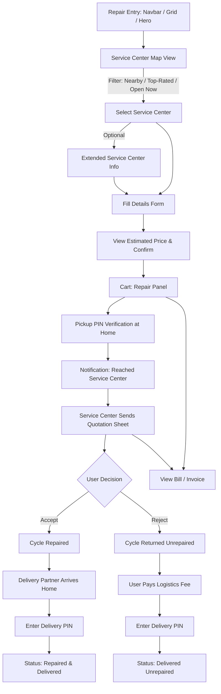
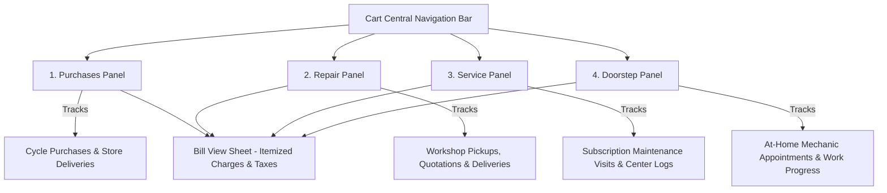
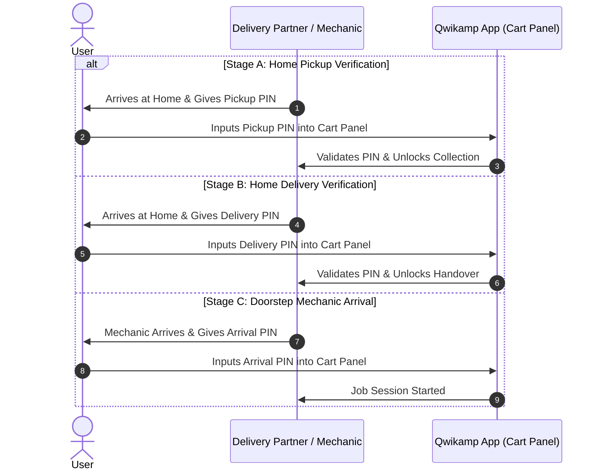

# Qwikamp — UI/UX Information Architecture & Systems Architecture

> **Document Version:** 1.1.0 (Post Design SVG Audit)  
> **Source-of-Truth Reference:** `svgqwikamp` Asset Corpus (105 SVG Screens & States)  
> **Target Platform:** Mobile & Web Applications  
> **Design System:** Qwikamp Design System (4-Tier Token Architecture)  
> **Core Domains:** E-Commerce Shopping, Workshop Repairs, Subscription Maintenance, Doorstep Repairs  

---

## 📐 1. System Overview & Core Information Architecture

Qwikamp is an end-to-end cycling mobility ecosystem integrating retail shopping, workshop repairs, subscription maintenance plans, and on-demand doorstep mechanical services.

---

## 🧭 2. Global Sitemap & Navigation Hierarchy

### 2.1 Navigation Hierarchy & Entry Points Matrix

| Page / Section | SVG File Reference | Entry Points | Navigation Scope | Primary Purpose |
| :--- | :--- | :--- | :--- | :--- |
| **Onboarding** | `Onboarding Screen*.svg`, `ONBORDING FLOW.svg` | App Launch (First Time) | Modal / Slide Flow | Feature Highlights & Value Proposition |
| **Login** | `OPT Screen.svg` | Post-Onboarding / Session Expiry | Dedicated Auth Screen | Mobile Number / Email Authentication |
| **OTP Verification** | `OPT Screen-1.svg` | Post-Login Submission | Dedicated Auth Screen | Security Code Validation |
| **Home Page** | `Home page*.svg`, `Dark home page*.svg` | Authenticated Root | Top Nav, Hero, 2x2 Grid, Bottom Nav | Main Hub & Direct Shortcuts (Light & Dark) |
| **Shop Page** | `Shop page*.svg` | Navbar, 2x2 Grid, Hero CTA | Catalog, Filters, Cycle Cards | Browse & Filter Cycles |
| **Product Details** | `product details page.svg` | Shop Catalog Card Click | Image Carousel, Specs, Color Picker, Buy CTA | Detailed Specs & Purchase Trigger |
| **Repair Page** | `Service center page*.svg` | **3 Entry Points:** Navbar, Hero Section, 2x2 Grid | Map Search, Filter Tabs, Workshop Pins | Select Service Center & View Map |
| **Extended Service Center**| `extended serivce center page.svg` | Service Center Pin Click | Workshop Profile, Hours, Ratings, Slots | Workshop Details & Rating Review |
| **Service Your Cycle** | `Home page-*.svg` (Services section) | 2x2 Grid, Home Services Section | Plan Cards (Basic/Standard/Premium), Details | Book Subscription Maintenance Plans |
| **Doorstep Repair** | `Home page-*.svg` (Doorstep section) | 2x2 Grid, Home Services Section | Plan Selection, Details Form, Slot Picker | Book At-Home Technician Visit |
| **Cart Page** | `booking in details*.svg` (16 states) | Top Navbar Icon, Bottom Bar | 4 Sub-Panels (Purchases, Repair, Service, Doorstep) | Booking Status, PIN Entry, Quotation Approval |
| **Bill View / Invoice** | `bill view*.svg` (3 states) | Cart Card "View Bill" Button | Itemized Invoice, Tax, Logistics Fees | Breakdown of Spares, Labor, Logistics |
| **Profile Page** | `Dark Profile page.svg` | Top Navbar Avatar, Bottom Bar | Account Settings, Orders, Saved Cycles | User Details, Preferences & Presets |

---

## 🔄 3. Detailed User Flow Architectures

### 3.1 Authentication & Onboarding Flow

---

### 3.2 Shopping Page Flow (E-Commerce & Cycle Delivery)

1. **Catalog Browsing (`Shop page*.svg`):** Browse categories (Mountain, Road, Electric, Hybrid) with dynamic filters.
2. **Product Details View (`product details page.svg`):** View technical specifications, color variants, sizing guide, and pricing.
3. **Checkout & Payment:** Input delivery address, choose payment method (Card/UPI/NetBanking), submit payment.
4. **Payment Confirmation:** Screen displays "Paid Successfully" with booking transaction ID.
5. **Cart Page (Purchases Panel - `booking in details*.svg`):**
   - Item moves to **Cart Page -> Purchases Panel**.
   - Displays real-time status: `Booking Confirmed` → `Dispatched with Delivery Partner`.
   - **Delivery PIN Handover Protocol:** When delivery partner arrives, user provides/inputs the **Delivery PIN** generated by delivery partner to verify partner authenticity and unlock final handover.
   - View Itemized Bill (`bill view.svg`).
   - Final status: `Delivered Successfully`.

---

### 3.3 Repair Page Flow (Workshop Pickup & Service Center)

#### Entry Shortcuts:
Accessible via **Navbar**, **Hero Section**, or **2x2 Home Grid**.

#### Step-by-Step Flow:
1. **Service Center Discovery Map (`Service center page*.svg`):**
   - Opens full interactive map displaying local verified workshops.
   - Dynamic Filter Tabs: `Nearby Centers`, `Top-Rated Centers`, `Open Now`.
   - Option to open `extended serivce center page.svg` for full workshop profile, working hours, and customer reviews.
   - User selects preferred Service Center.
2. **Repair Details Form:**
   - **Service Type:** General Overhaul, Tune-up, Component Replacement.
   - **Repair Category:** Brakes, Gears, Chain, Suspension, Frame, Custom.
   - **Cycle Metadata:** Cycle Brand/Name & Color.
   - **Pickup Time Slot:** Schedule time for cycle pickup from home to service center.
   - **Issue Description:** Elaborate problem description / photo attachments.
   - **Current Location:** Auto-GPS pin drop or custom address entry.
3. **Price Estimation & Booking:**
   - Displays **Estimated Cost** (non-final preview: basic inspection + pickup/delivery charges).
   - User confirms booking.
4. **Cart Page (Repair Panel) Management & Quotation Logic (`booking in details-*.svg`):**
   - Booking appears under **Cart -> Repair Panel**.
   - **Pickup PIN Phase:** Delivery partner arrives at user home to pick up cycle. User enters **Pickup PIN** (provided by partner) to authorize collection.
   - **In-Transit Status:** Updates to `In Transit` → `Reached Service Center`.
   - **Quotation Stage:** Service center inspects cycle and issues an itemized quotation inside the Cart Repair Panel.
   - **User Decision Branch:**
     - **ACCEPT QUOTATION:** Service center executes repair. Repaired cycle dispatched. Delivery partner arrives at home -> User enters **Delivery PIN** -> Status `Repaired & Delivered`.
     - **REJECT QUOTATION:** Cycle returned home without repairs. User pays pickup & delivery fee only. Delivery partner arrives at home -> User enters **Delivery PIN** -> Status `Returned Unrepaired`.

---

### 3.4 Service Your Cycle Flow (Subscription Plans)

1. **Plan Selection:** Choose from 3 Subscription Plans:
   - 🟢 **Basic Plan:** Quarterly checkups, chain lubrication, brake adjustment.
   - 🔵 **Standard Plan:** Bi-monthly tune-ups, wheel alignment, free cable replacements.
   - 🟣 **Premium Plan:** Monthly comprehensive overhaul, priority workshop booking, free wear-and-tear parts.
2. **Details Form & Estimation:**
   - Input Cycle Name, Color, Pickup Time Slot, Current Location, and specific issues.
   - View estimated add-on cost (if non-covered services requested).
3. **Cart Page (Service Panel) Tracking (`booking in details-*.svg`):**
   - Card created in **Cart -> Service Panel**.
   - Delivery partner pickup at home -> **Pickup PIN Entry** (provided by delivery partner).
   - Real-time status update: `Reached Service Center`.
   - Servicing completion details and full service log displayed in panel.
   - Delivery back to home -> **Delivery PIN Entry** (provided by delivery partner).
   - Status updated to `Serviced & Delivered`.

```mermaid
flowchart LR
    A[Service Page] --> B[Select Plan: Basic / Standard / Premium]
    B --> C[Fill Cycle Details & Location]
    C --> D[View Estimated Cost & Book]
    D --> E[Cart: Service Panel]
    E --> F[Enter Pickup PIN to Delivery Partner]
    F --> G[Notification: Reached Service Center]
    G --> H[Service Completed & Dispatched]
    H --> I[Enter Delivery PIN to Partner]
    I --> J[Status: Service Completed]
```

---

### 3.5 Doorstep Repair Flow (At-Home Mechanic Service)

> 💡 **Key Distinction:** Unlike workshop repair/servicing, a mechanic travels directly to the user's home location to repair the cycle on-site without transporting it away.

1. **Plan Selection:** Select doorstep plan (**Basic**, **Standard**, **Premium**).
2. **Details & Scheduling:**
   - Input Cycle Name, Color, Specific Issues, Preferred Home Slot, Location.
   - Review estimated price breakdown.
3. **Booking Confirmation:**
   - Card created under **Cart -> Doorstep Panel**.
4. **Doorstep Execution & PIN Verification (`booking in details-*.svg`):**
   - Mechanic assigned & arrives at home location.
   - **Arrival PIN Entry:** User inputs the PIN provided by the mechanic to initiate the doorstep job session.
   - Real-time status: `Mechanic Working at Home`.
   - Completion check & digital invoice sign-off (`bill view.svg`).
   - Status updated to `Doorstep Repair Completed`.

```mermaid
flowchart LR
    A[Doorstep Page] --> B[Select Plan: Basic / Standard / Premium]
    B --> C[Fill Details & Preferred Time Slot]
    C --> D[View Estimated Cost & Book]
    D --> E[Cart: Doorstep Panel]
    E --> F[Mechanic Arrives at Home]
    F --> G[Enter Arrival PIN to Start Repair]
    G --> H[Status: Repairing at Home]
    H --> I[Job Completion & Sign-off]
    I --> J[Status: Doorstep Repair Completed]
```

---

## 🛒 4. Cart System & Multi-Panel Architecture

The Cart Page serves as the operational command center for all user bookings, divided into 4 dedicated panels:

### 4.1 Card State Matrix Across Cart Panels

| Panel Name | SVG Design State Mapping | Key Data Elements Shown | Interactive Actions Available | Verification Required |
| :--- | :--- | :--- | :--- | :--- |
| **Purchases Panel** | `booking in details-1.svg` to `3.svg` | Cycle Specs, Order ID, Price, Delivery Partner Details, Status Timeline | View Invoice, Track Delivery, Contact Partner | **Delivery PIN** (Partner → User) |
| **Repair Panel** | `booking in details-4.svg` to `9.svg` | Service Center Name, Cycle Info, Pickup Slot, Quotation Sheet, Status | **Accept/Reject Quotation**, Call Center, View Bill | **Pickup PIN** & **Delivery PIN** |
| **Service Panel** | `booking in details-10.svg` to `12.svg` | Subscription Tier, Service Checklist, Workshop Log, Status Timeline | View Inspection Report, Rate Workshop | **Pickup PIN** & **Delivery PIN** |
| **Doorstep Panel** | `booking in details-13.svg` to `15.svg` | Mechanic Profile, Visit Time Slot, Issue Log, Live Repair Status | Call Mechanic, Extend Scope, Sign-off | **Mechanic Arrival PIN** |

---

## 🔒 5. Security & Verification PIN System Architecture

To prevent unauthorized handovers, ensure partner verification, and secure physical handoffs, Qwikamp implements a strict 3-tier PIN verification model:

---

## 📱 6. Component-Level Screen Inventory & Structure

### 6.1 Home Page Layout Architecture (`Home page*.svg`, `Dark home page*.svg`)
- **Header:** Location Selector, Search Bar, Cart Icon (with active badge count), Profile Shortcut.
- **Hero Banner:** Dynamic Promotional Banner & Quick CTA ("Book Urgent Repair").
- **2x2 Feature Action Grid:**
  1. 🚴 **Shop Cycles:** Direct route to retail catalog.
  2. 🛠️ **Repair Cycle:** Direct route to nearby workshop map.
  3. 🧰 **Service Cycle:** Direct route to subscription plans.
  4. 🏡 **Doorstep Repair:** Direct route to at-home mechanic booking.
- **Quick Status Section:** Active booking summary widget linked to relevant Cart Panel.

### 6.2 Service Center Map Page Architecture (`Service center page*.svg`)
- **Top Bar:** Location Input & View Switcher (Map View / List View).
- **Filter Tabs:** `Nearby Centers` | `Top-Rated Centers` | `Open Now`.
- **Map Viewport:** Custom Map Pins with ratings and turn-around times.
- **Center Sheet Card:** Center Name, Distance, Rating, Available Slots, "Select Center" Button.

### 6.3 Extended Service Center Page Architecture (`extended serivce center page.svg`)
- **Header:** Workshop Image Banner, Workshop Name, Verified Badge, Rating Stars.
- **Body:** Address, Working Hours (`Open Now`), Contact Number, List of Amenities & Specialized Services.
- **Reviews Section:** Customer ratings, feedback tags.
- **Footer CTA:** "Select This Workshop & Proceed to Booking".

### 6.4 Bill View / Invoice Sheet Architecture (`bill view*.svg`)
- **Header:** Order / Booking Reference ID, Date & Time Stamp, Service Provider Details.
- **Itemized Breakdown Table:**
  - Base Fee / Inspection Fee.
  - Spares & Component Charges (Itemized).
  - Repair Labor Fee.
  - Logistics / Pickup & Home Delivery Charges.
- **Tax & Discount Summary:** GST breakdown, promo code applied, final total amount.
- **Payment Status Badge:** `Paid Online` / `Pending Handover Payment`.

---

## 🎨 7. Design System Token Alignment

All UI components and flows leverage the **Qwikamp Design System 4-Tier Token Architecture**:

1. **Brand Layer (`brand.*`):** Slate, Gray, Blue, Green, Red, Orange, Lime palettes, Inter font families, 8pt spacing grid.
2. **Alias Layer (`alias.*`):** Primary/Secondary/Tertiary semantic tokens, Information/Success/Error/Warning aliases.
3. **Mapped Component Layer (`maps.*`):**
   - `maps.surface.*`: Surface cards for Cart panels, bill views, & map bottom sheets (Light & Dark theme mapped).
   - `maps.text.*`: High-contrast headings and status texts for light/dark themes.
   - `maps.border.*`: Active state borders for selected service centers and plan cards.
4. **Responsive Layer (`responsive.*`):** H1-H6, Hero, Paragraph, and Caption typography scales across viewport sizes.

---

## 🔍 8. Design Source-of-Truth Audit (`svgqwikamp` Verification)

| Category | SVGs Found | Verified Architecture Features | Alignment Status |
| :--- | :--- | :--- | :--- |
| **Onboarding & Auth** | 6 SVGs (`Onboarding Screen*.svg`, `OPT Screen*.svg`) | 3-step carousel, Mobile number auth, OTP verification code screen | 100% Verified |
| **Home Page** | 56 SVGs (`Home page*.svg`, `Dark home page*.svg`) | Light/Dark modes, Top Nav, Hero Banner, 2x2 Action Grid, 3 Repair shortcuts | 100% Verified |
| **Shop & Product** | 13 SVGs (`Shop page*.svg`, `product details page.svg`) | Catalog filters, Cycle cards, Product details carousel, Specs sheet, Buy CTA | 100% Verified |
| **Service Centers** | 5 SVGs (`Service center page*.svg`, `extended...svg`) | Map view, 3 filter tabs (Nearby/Top-Rated/Open Now), Extended profile sheet | 100% Verified |
| **Cart & Booking** | 16 SVGs (`booking in details*.svg`) | 4 Sub-Panels (Purchases, Repair, Service, Doorstep), PIN entry modals, Quotation box | 100% Verified |
| **Invoice / Bill** | 3 SVGs (`bill view*.svg`) | Itemized parts/labor costs, delivery fee breakdown, tax total, payment badge | 100% Verified |
| **User Profile** | 1 SVG (`Dark Profile page.svg`) | Account details, saved cycles, active plan badges, order history | 100% Verified |

---

## 📝 9. Summary of Flow Verification Rules

> [!IMPORTANT]
> **Delivery Partner PIN Verification Rule:**  
> In all delivery and pickup operations (Shop Delivery, Workshop Pickup, Workshop Delivery), the delivery partner generates a unique PIN upon arrival, which the user must enter into the app to complete the step.

> [!NOTE]
> **Workshop Quotation Decision Rule:**  
> If a user **rejects** a workshop quotation, the cycle is returned unrepaired, but the user is billed for pickup and delivery logistics. If **accepted**, repair costs are added to the final bill, payable before delivery.

> [!TIP]
> **Doorstep Repair Advantage:**  
> Doorstep repair bypasses workshop logistics completely. The PIN is validated upon mechanic arrival, enabling instant home repair with zero transit time.
